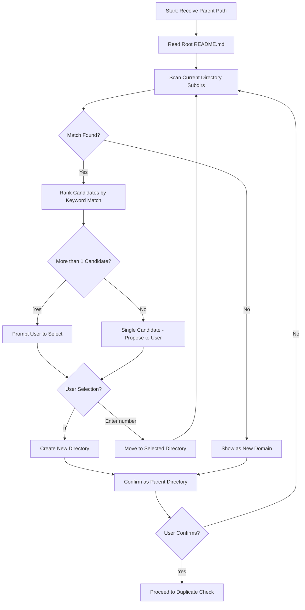

# Subskill: Create Topic Node

## Goal

Create a new topic (or sub-topic) directory in the knowledge tree with basic node initialization. Includes automatic best placement discovery, user interaction for confirmation, duplicate checking, and directory tree output.

## Input

- Parent directory path (passed from SKILL.md after config check)
- New topic name
- One-sentence topic definition
- Optional: initial sub-topic list

## Execution Steps

### 1. Find Best Placement Directory (Iterative Traversal + User Confirmation)



#### 1.1 Start from Vault Root

Read the vault root's `README.md` (if exists) to understand the overall structure.

#### 1.2 Match Current Directory

Based on the topic's category/keywords, find suitable subdirectories by reading their `README.md` content:

- Scan all subdirectories in current directory
- For each subdirectory, read its `README.md` (if exists)
- Match against topic keywords in the README content (title, definition, boundary)
- Ranking rules:
  - High: keyword appears in title or definition
  - Medium: keyword appears in boundary/includes
  - Low: keyword appears elsewhere in content
  - No match: treat as new domain

#### 1.3 Output All Directories (if uncertain)

If unable to determine the appropriate parent directory (e.g., no subdirectories match), use the `tree` command to output the current vault directory structure:

```bash
tree -L 5 -d /path/to/vault
```

- `-L 5`: Show up to 5 levels of directories
- `-d`: Show directories only, not files

Example output:
```
vault/
├── programming/
│   ├── frontend/
│   └── backend/
├── design/
│   └── ui/
└── ...

Please specify the parent directory path, or enter n to create a new directory at root:
```

#### 1.4 User Confirmation

If there are multiple candidates or need to enter subdirectories, **pause and let user confirm**:

```
Current candidate directories:
1. /vault/programming/frontend/ - keyword match: frontend
2. /vault/programming/backend/ - keyword match: backend
3. /vault/programming/ - root level

Please select [1-3], or enter n to create new directory:
```

#### 1.5 Iterative Traversal

Repeat steps 1.2-1.4 until user selects a directory as the final parent directory, or confirms a new directory needs to be created.

### 2. User Confirms Directory

Output the found parent directory path and ask if it meets expectations:

```
Final parent directory: [path]
Confirm? [Y/n]
```

- If user enters `n`, return to step 1 to reselect
- If user enters a specific path (e.g., `/vault/programming/frontend/React/`), use that path directly

### 3. Check for Duplicates

- List all subdirectories under the parent directory
- Check if a directory with the same name already exists
- If exists, output warning:

```
⚠️ Warning: Directory [parent_path]/[topic_name] already exists
Existing content:
- README.md
- FAQ.md
- subtopicA/

Overwrite? [y/N]
```

- If user chooses not to overwrite, end the process

### 4. Create Directory Structure

Create the following directory structure:

```
/[topic-name]/
├── README.md      # Basic structure: Definition + Boundary + Sub-topic Index
└── FAQ.md         # FAQ documentation
```

#### README.md Template

Use `resources/README-template.md` as the template. Only fill in content provided by the user - leave placeholders for content not mentioned (e.g., Sub-topic Index section should remain with placeholder content).

#### FAQ.md Template

Use `resources/FAQ-template.md` as the template, copy the template content and add the scope description. Only include content provided by the user.

#### 4.3 Optimize Formatting (IMPORTANT)

**This step is REQUIRED.** Use the `/obsidian-markdown` skill to optimize the file content:
- Normalize Markdown format
- Optimize heading hierarchy
- Adjust list styles
- Add appropriate spacing and separators

### 5. Update Parent Directory README.md

After creating the directory, update the parent directory's `README.md` file to add sub-topic index:

1. Read the parent directory's `README.md`
2. Add the new topic link under `## Sub-topic Index`:

```markdown
## Sub-topic Index

- [[topic_name/README.md]]
```

If `## Sub-topic Index` section does not exist, create it.

### 6. Recursively Create Sub-topics (if provided)

If the user provides an initial sub-topic list, recursively create sub-topic directories with their `README.md` and `FAQ.md`.

### 7. Output Directory Tree

Use the `tree` command or manual traversal to output the created directory structure:

```
✅ Directory creation complete!

[parent_directory]/
└── [topic_name]/
    ├── README.md
    ├── FAQ.md
    └── [subtopic1]/
        ├── README.md
        └── FAQ.md
```

## Acceptance Criteria

- [ ] User can iteratively confirm directory selection
- [ ] Duplicate directory detection works correctly
- [ ] New topic directory structure is complete (contains at least `README.md` and `FAQ.md`)
- [ ] `README.md` follows three-section format (Definition + Boundary + Sub-topic Index)
- [ ] `FAQ.md` uses template structure
- [ ] Parent directory `README.md` updated with new topic in sub-topic index
- [ ] Directory tree output is correct
- [ ] If sub-topic list provided, recursive creation succeeds

## Helper Tools

- Directory tree display: Use `tree -L 3 <path>` command
