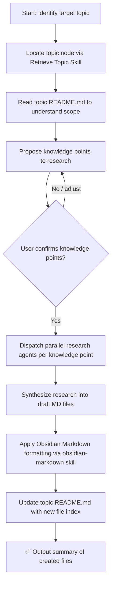

# Subskill: Deep-in Topic

## Goal

Conduct deep, comprehensive research on a specified topic and produce authoritative knowledge-point Markdown files. Unlike the Divide Into Topic skill (which structures sub-topics), this skill goes **deep into a single topic** — producing rich, substantive content files ready to be "fruit nodes" in the knowledge tree.

## Input

- Target topic name or path
- Vault root path (resolved from configuration `obsidian_vault_path`)
- Optional: specific knowledge points or angles the user wants to focus on

## Execution Steps

### Flow Overview



---

### Step 1: Locate Target Topic

Invoke the **[Retrieve Topic Node](./retrieval-topic-skill.md)** subskill using the user-specified topic name as the query.

- On success: obtain the confirmed topic directory path and read its `README.md` to understand the current scope, existing sub-topics, and what knowledge files already exist.
- If not found: inform the user and stop. Suggest creating the topic first with the **[Create Topic Skill](./create-topic-skill.md)**.

---

### Step 2: Propose Knowledge Points (Human-in-the-Loop)

Based on the topic's `README.md` and scope, propose a concrete list of **knowledge points** to research and produce as individual files.

Each knowledge point corresponds to one output `.md` file.

Present them to the user:

```
I'll research the following knowledge points for "[Topic]":

1. [Knowledge Point A] — e.g., "How the event loop works in JavaScript"
2. [Knowledge Point B] — e.g., "Comparison of JavaScript module systems (CJS vs ESM)"
3. [Knowledge Point C] — e.g., "Prototype chain and inheritance mechanisms"

Do you want to adjust, add, or remove any knowledge points before I start researching?
```

Iterate with the user until the list is explicitly confirmed. Do not proceed to Step 3 without confirmation.

---

### Step 3: Parallel Deep Research

Once the knowledge point list is confirmed, dispatch **multiple sub-agents in parallel** — one per knowledge point — each using the `web_search` tool to conduct deep research.

Each research agent must:

1. **Search broadly first**: find authoritative sources (official docs, papers, reputable blogs, MDN, RFC specs, etc.)
2. **Search deeply**: follow up with targeted queries to cover edge cases, common pitfalls, and advanced nuances
3. **Synthesize findings** into a structured draft covering:
   - Core concepts and definitions
   - How it works (mechanisms, internals)
   - Practical usage and examples
   - Common pitfalls / gotchas
   - Advanced considerations
   - References and further reading

**Research quality requirements:**
- **Comprehensive**: cover both fundamentals and advanced aspects
- **Authoritative**: prefer official documentation, specifications, and well-known expert sources
- **Deep**: do not stop at surface-level explanations — dig into the "why" and internals

---

### Step 4: Generate Knowledge Point Files

For each researched knowledge point, produce a `.md` file in the target topic directory.

**File naming**: use kebab-case based on the knowledge point name.
Example: `event-loop.md`, `module-systems.md`, `prototype-chain.md`

**File structure**: strictly follow `resources/CONTENT-template.md`. Key elements to fill in:

| Template 占位符 | 填写内容 |
|----------------|---------|
| `title` | 知识点标题 |
| `date` | 当前日期（`YYYY-MM-DD`） |
| `tags` | 继承父 topic 的 tags，追加知识点相关标签 |
| `aliases` | 知识点的英文名或常见别称 |
| `cssclass` | 所属 topic 名称 |
| `[!abstract]` 目录 | 根据实际章节生成 wikilink 锚点目录 |
| 一级 / 二级 / 子小节 | 按研究内容填充，保持模板层级结构 |
| `[!tip]` / `[!warning]` / `[!info]` callout | 用于补充提示、常见错误、推荐做法 |
| 对比表格 | 有多方案/多类型对比时使用，含 ✅/❌ 标记 |
| `[!success]` 总结 | 用 1–4 条核心要点收尾 |
| `相关资料` | 官方文档外链 + vault 内 wikilink |

---

### Step 5: Obsidian Markdown Formatting

After all draft files are generated, invoke the **`/obsidian-markdown` skill** on each file to:

- 校验并补全 frontmatter（`title`、`date`、`tags`、`aliases`、`cssclass`）
- 将普通链接替换为 wikilink（`[[...]]`），关联 vault 内已有 topic
- 确保 callout 语法正确（`> [!type]`）
- 优化代码块语言标注、表格对齐、标题层级一致性

---

### Step 6: Update Topic README.md

After all files are created and formatted, update the target topic's `README.md`:

1. Read the current `README.md`
2. Add each new file under the appropriate section. If a `## Knowledge Files` (or similar) section exists, append there. If not, create it:

```markdown
## Knowledge Files

- [[event-loop.md]] — How the JavaScript event loop works
- [[module-systems.md]] — Comparison of CJS vs ESM module systems
- [[prototype-chain.md]] — Prototype chain and inheritance mechanisms
```

3. Use wikilink format `[[filename]]` for all entries.

---

### Step 7: Output Summary

Output a clear summary of what was created:

```
✅ Deep research complete for topic: [Topic]

Files created:
  📄 event-loop.md
  📄 module-systems.md
  📄 prototype-chain.md

Location: [topic_path]/

README.md updated with links to all 3 new files.
```

---

## Acceptance Criteria

- [ ] Target topic is located via Retrieve Topic subskill
- [ ] Knowledge points are proposed and confirmed by user before research begins
- [ ] Research is dispatched in parallel across all confirmed knowledge points
- [ ] Each knowledge point produces a well-structured `.md` file
- [ ] Research content is comprehensive, authoritative, and deep
- [ ] All files are formatted with Obsidian Markdown via `/obsidian-markdown` skill
- [ ] Topic `README.md` is updated with wikilinks to all new files
- [ ] Final summary is outputted

## Helper Tools

- Web search: `web_search` tool (use multiple targeted queries per knowledge point)
- Formatting: `/obsidian-markdown` skill
- Directory listing: `ls <topic_path>`
- Parallel dispatch: invoke multiple sub-agents simultaneously for Step 3
