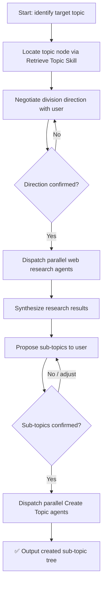

# Subskill: Divide Into Topic

## Goal

Divide a large topic into smaller, well-defined sub-topic nodes in the knowledge tree. This skill breaks down a broad topic into its core sub-topics through web research and user collaboration, making the knowledge tree more granular and navigable.

## Input

- Target topic name or path (the topic to dive into)
- Vault root path (resolved from configuration `obsidian_vault_path`)

## Execution Steps

### Flow Overview



---

### Step 1: Locate Target Topic

Invoke the **[Retrieve Topic Node](./retrieval-topic-skill.md)** subskill using the user-specified topic name as the query.

- On success: obtain the confirmed topic directory path and read its `README.md` to understand the current scope and existing sub-topics.
- If not found: inform the user and offer to create the topic first using the **[Create Topic Skill](./create-topic-skill.md)**.

---

### Step 2: Negotiate Division Direction (Human-in-the-Loop)

Before researching, align with the user on how to divide the topic.

1. **Initial proposal**: Based on the topic's README and any general knowledge, propose 3–5 candidate research directions. For each, provide a one-sentence rationale.

   Example for topic "Frontend":
   ```
   I can divide "Frontend" into the following sub-areas:

   1. Core language fundamentals (HTML, CSS, JavaScript)
   2. Frontend frameworks & libraries (React, Vue, Angular)
   3. Engineering & toolchain (bundlers, CI/CD, testing)
   4. Performance optimization
   5. Career path & skill progression

   Which division angle(s) do you want to use? You can pick multiple or suggest your own.
   ```

2. **Use web search** to enrich your understanding of the topic before proposing directions, if the topic is broad or unfamiliar.

3. **Iterate**: If the user adjusts or rejects directions, refine the proposal until the user explicitly confirms. Do not proceed to Step 3 without confirmation.

---

### Step 3: Parallel Web Research

Once the division direction is confirmed, dispatch **multiple sub-agents in parallel** — one per confirmed direction — to perform deep web research.

Each sub-agent should:
- Search for authoritative sources, learning maps, and expert opinions on the direction.
- Identify the **core knowledge areas** within that direction (these become candidates for sub-topics).
- Summarize findings: key concepts, typical sub-domains, commonly recognized categories.

Synthesize all sub-agent results into a unified research report before proceeding.

---

### Step 4: Propose Sub-Topics (Human-in-the-Loop)

Based on the research report, propose a concrete list of sub-topics to create under the target topic.

Present them clearly:

```
Based on the research, here are the proposed sub-topics for "[Topic]":

Under direction "Core language fundamentals":
  - HTML & Semantics
  - CSS & Layout
  - JavaScript Fundamentals

Under direction "Frontend frameworks":
  - React
  - Vue
  - Angular

Do you want to adjust, remove, or add any sub-topics before I create them?
```

Iterate with the user until the list is explicitly confirmed. Do not proceed to Step 5 without confirmation.

---

### Step 5: Parallel Sub-Topic Creation

Once the sub-topic list is confirmed, dispatch **multiple Create Topic agents in parallel** — one per sub-topic — using the **[Create Topic Skill](./create-topic-skill.md)**.

Each agent receives:
- Parent directory: the target topic path (from Step 1)
- Sub-topic name
- One-sentence definition (derived from research)

> Skip the "Find Best Placement Directory" step inside Create Topic — the parent is already known.

---

### Step 6: Output Result

After all sub-topics are created, output the resulting directory tree:

```
✅ Dive-into complete for topic: [Topic]

[topic_path]/
├── README.md
├── FAQ.md
├── [subtopic-1]/
│   ├── README.md
│   └── FAQ.md
├── [subtopic-2]/
│   ├── README.md
│   └── FAQ.md
└── [subtopic-3]/
    ├── README.md
    └── FAQ.md
```

Also update the target topic's `README.md` Sub-topic Index to include links to all newly created sub-topics (if not already updated by Create Topic agents).

---

## Acceptance Criteria

- [ ] Target topic is located via Retrieve Topic subskill
- [ ] Research direction is negotiated and confirmed by user before any research begins
- [ ] Web research is dispatched in parallel across confirmed directions
- [ ] Sub-topic proposals are derived from research and confirmed by user
- [ ] Sub-topics are created in parallel using Create Topic subskill
- [ ] Target topic's README.md Sub-topic Index is updated
- [ ] Final directory tree is outputted

## Helper Tools

- Web search: use the `web_search` tool to research each direction
- Directory tree: `tree -L 3 <topic_path>`
- Parallel dispatch: invoke multiple sub-agents simultaneously for Steps 3 and 5
