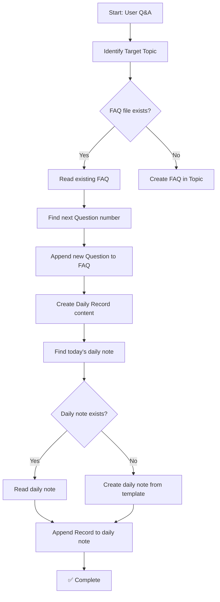

# Upsert FAQ

## Goal

将技术 Q&A 知识沉淀到对应 Topic 的 FAQ 文件中，并在今日日报中新增一条 Record 记录。

## Input

- **Q&A 内容**: 用户询问的技术问题及答案（由对话中获取）
- **Target Topic**: 知识所属的 Topic（从对话上下文推断或用户指定）
- **Record 内容**: 摘要记录，供日报使用

## Constraints

- **FAQ 文件**: 必须使用 `> [!faq]-` callout 格式，标题行后必须有空行 `>`
- **FAQ 编号**: 使用连续编号（Question 1, Question 2...），找到文件中最大的编号后 +1
- **Record 格式**: 必须使用 `> [!record]` callout，包含内容、来源、Topic、路径字段
- **日报路径**: `Daily/<year>/<MM-DD>.md`

## Execution Flow



## Execution Steps

### 1. Identify Target Topic

从对话上下文推断知识所属的 Topic：

| 场景 | Topic 路径 |
|------|-----------|
| React 相关问题 | `学习/web/frontend/框架/React/` |
| 前端通用问题 | `学习/web/frontend/` |
| 后端问题 | 根据具体技术栈确定 |

如果无法推断，使用 AskUserQuestion 询问用户。

### 2. Locate FAQ File

1. 在目标 Topic 目录下查找 `FAQ.md`
2. 如果不存在，创建空的 FAQ 文件（遵循 FAQ-template.md 格式）

### 3. Determine Question Number

1. 读取现有 FAQ 内容
2. 查找所有 `Question N：` 模式的编号
3. 取最大值 +1 作为新问题编号
4. 如果没有现有问题，设为 Question 1

### 4. Append Question to FAQ

使用 Bash `cat >>` 追加内容（避免 Edit 工具的精确匹配问题）：

```markdown
> [!faq]- Question N：问题标题
>
> **问题是什么？**
> 问题的简要描述
>
> **背景是什么？**
> 问题的业务/技术背景
>
> ---
>
> **涉及哪些知识点？**
> - 知识点1
> - 知识点2
>
> **答案是什么？**
>
> **核心原理：**
> 核心概念解释
>
> **代码示例：**
> ```tsx
> // 代码示例
> ```
>
> **关键实践要点：**
> 1. 要点1
> 2. 要点2
>
> **为什么这个方案有效：**
> - 原因1
> - 原因2
```

### 5. Get Today's Date

```bash
bun scripts/get-dates.ts
```

解析 JSON 输出获取 `today`（格式：`YYYY-MM-DD`）。

### 6. Locate or Create Daily Note

1. 计算日报路径：`Daily/<year>/<MM-DD>.md`
2. 如果文件不存在，使用 `resources/Daily-Note-template.md` 创建

### 7. Append Record to Daily Note

在 Records 章节后追加 Record：

```markdown
> [!record] 记录标题
>
> **内容:** 记录的详细内容
>
> **来源:** (可选) 来源信息
>
> **Topic:** [[Topic路径/README]]
>
> **路径:** [[FAQ.md路径]] （Question N）
```

### 8. Output Summary

```
✅ FAQ 已更新: <topic>/FAQ.md (Question N)

📋 日报已更新: Daily/<year>/<MM-DD>.md
```

## Acceptance Criteria

- [ ] 正确识别目标 Topic
- [ ] FAQ 使用 `> [!faq]-` 格式，标题后有空行
- [ ] Question 编号连续递增
- [ ] Record 使用 `> [!record]` 格式，包含所有必需字段
- [ ] 日报路径正确：`Daily/<year>/<MM-DD>.md`

## Helper Tools

- 日期获取: `bun scripts/get-dates.ts`
- 追加内容: `cat >> <file> << 'EOF' ... EOF`
- 查找 Question 编号: `grep -oP 'Question \K\d+' <file> | sort -n | tail -1`
