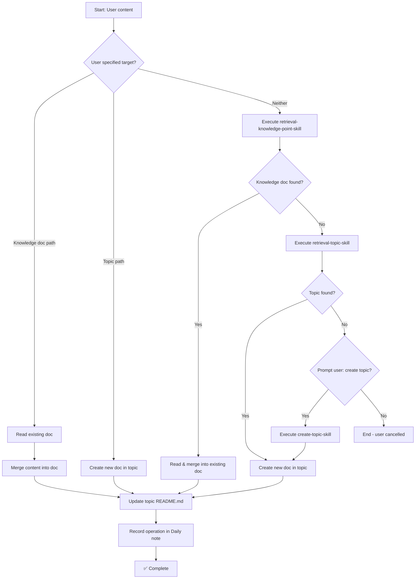

# Upsert Knowledge Point

## Goal

Save user-specified content as a knowledge document in the most relevant topic. If a similar knowledge document already exists, merge the new content into the existing document. If not, create a new knowledge document in the appropriate topic.

## Input

- **Content to save**: The source material to be preserved (provided by user)
- **Optional**: Explicit target path, one of:
  - Knowledge document path (e.g., `path/to/knowledge-doc.md`) — update existing doc
  - Topic path (e.g., `path/to/topic/`) — create new doc in topic
  - If neither provided — use retrieval to find best match

## Constraints

- **File naming**: `{index}.{knowledge-point-name}.md`
- **Content formatting**: Must use `resources/CONTENT-template.md` as the base structure
- **Index update**: The topic's `README.md` must be updated to include/refresh the knowledge point index
- **Daily logging**: All operations (insert or update) must be recorded in today's Daily note with document address and update summary

## Execution Flow



## Execution Steps

### 1. Check User Input

Determine the operation mode based on user input:

| Input Type | Action |
|------------|--------|
| Knowledge document path provided | Skip to **Step 3 (Update Doc)** |
| Topic path provided | Skip to **Step 4 (Create Doc)** |
| Neither provided | Execute **Step 2 (Retrieve)** |

### 2. Retrieve Target

Invoke the **[Retrieve Knowledge Point](./retrieval-knowledge-point-skill.md)** subskill to locate the most relevant knowledge document for the user's content.

- If a matching knowledge document is found → proceed to **Step 3 (Update Doc)**
- If no match is found → invoke **[Retrieve Topic](./retrieval-topic-skill.md)** to find relevant topic:
  - Topic found → proceed to **Step 4 (Create Doc)**
  - No topic found → proceed to **Step 2.1 (Prompt)**

### 2.1 Prompt for Topic Creation

If no matching topic was found:

```
⚠️ No matching topic found for your content.

Would you like to create a new topic? [y/N]
```

- **User selects "Yes"** → Invoke **[Create Topic](./create-topic-skill.md)** subskill, then proceed to Step 4 with the newly created topic
- **User selects "No"** → End the process

### 3. Update Existing Knowledge Document

1. **Read the existing document** to understand its current structure and content
2. **Analyze the new content** to identify what should be merged:
   - New sections that don't exist in the original
   - Additional details for existing sections
   - Updated information that supersedes old content
3. **Merge content** into the existing document following `CONTENT-template.md` structure
4. **Preserve existing metadata** (frontmatter, title, date)
5. Update the `date` in frontmatter to today's date
6. Proceed to **Step 5 (Update README)**

### 4. Create New Knowledge Document

If a topic was found (or newly created):

1. **Determine file index**: List existing knowledge files in the topic directory, find the next available index
2. **Determine knowledge point name**: Ask user for confirmation or generate from content summary
3. **Read the content template**: Use `resources/CONTENT-template.md` as base
4. **Generate content file**: Fill the template with user's content
5. **Optimize formatting**: Use **[Optimize Topic Files](./optimize-topic-files-skill.md)** skill
6. Proceed to **Step 5 (Update README)**

### 5. Update Topic README.md

1. Read the topic's `README.md`
2. Locate or create the knowledge point index section
3. If updating an existing document: refresh its entry
4. If creating a new document: add the new knowledge point entry:

```markdown
## Knowledge Points Index

- [[1.Existing-Doc|Existing Doc Title]]
- [[2.New-Doc|New Doc Title]]
```

### 6. Record in Daily Note

使用 [Update Daily Note Skill](../daily-note/update-daily-note-skill.md) 往 Records 插入一条记录。

需要提供的字段值:

- **记录标题:** 本次操作的简要描述（如"新建：xxx"或"更新：xxx"）
- **内容:** 记录详细内容，**必须详细完整**，能够完整还原文件变更的内容
- **来源:** 用户指定的来源（如 "Claude Code 研究"）
- **Topic:** `[[topic-name/README.md]]`
- **路径:** `[[文档路径]]`

> [!warning] 内容要求
> `**内容**` 字段必须足够详细和完整，以便在没有文档的情况下也能了解本次文件变更的具体内容是什么。包括但不限于：新增了哪些章节、删除了哪些内容、核心观点是什么、关键结论有哪些。

### 7. Output Summary

```
✅ Knowledge point upsert complete!

Operation: Created / Updated
Document: [topic_path]/[index].[knowledge-point-name].md
Topic: [topic_path]

Daily note updated: [daily_note_path]
```

## Acceptance Criteria

- [ ] Handles explicit knowledge document path (skip retrieval, update directly)
- [ ] Handles explicit topic path (skip retrieval, create new doc in topic)
- [ ] Falls back to retrieval when no explicit path provided
- [ ] Retrieves knowledge doc via retrieval-knowledge-point-skill
- [ ] Retrieves topic via retrieval-topic-skill if no doc found
- [ ] Prompts for topic creation when retrieval finds nothing
- [ ] Merges new content into existing document
- [ ] Creates new document following CONTENT-template.md structure
- [ ] Updates topic's README.md with knowledge point index
- [ ] Records operation in today's Daily note via update-daily-note-skill

## Helper Tools

- List files in directory: `ls -la <path>`
- Filter knowledge files: `ls <path> | grep -E '^[0-9]+\.'`
- Read template: `cat resources/CONTENT-template.md`
- Read topic README: `cat <topic_path>/README.md`
- Today's date: Use `date +%Y-%m-%d` command
