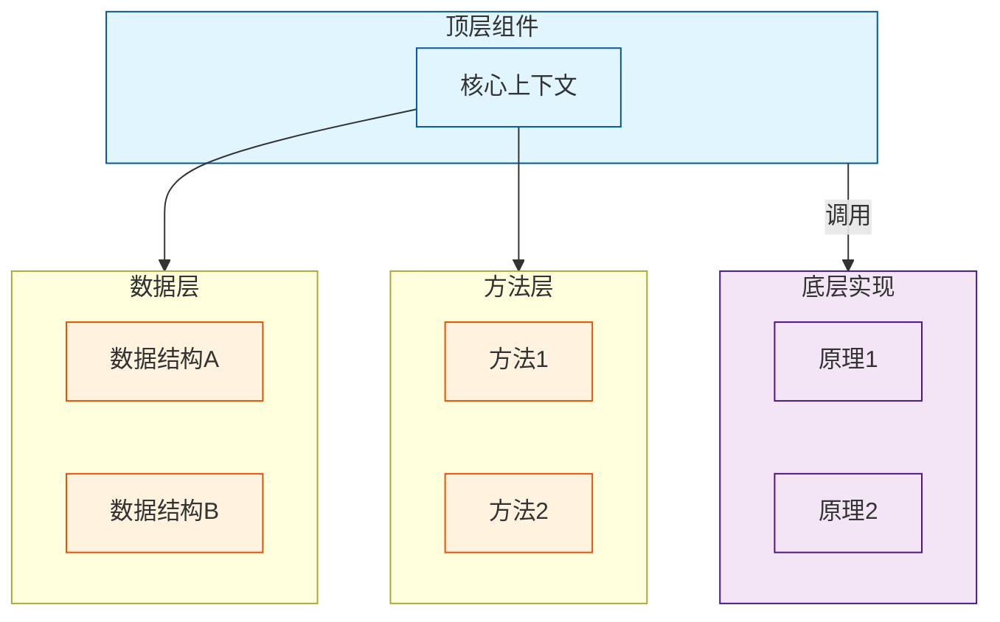
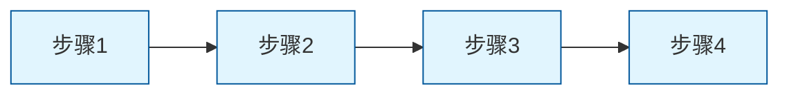
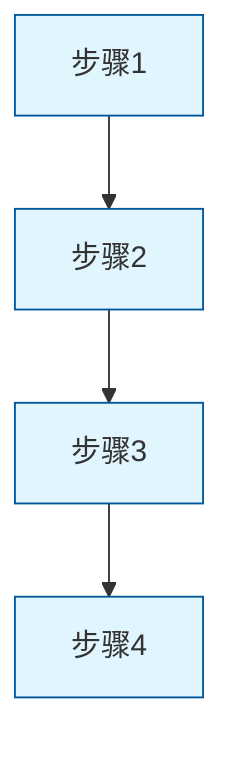
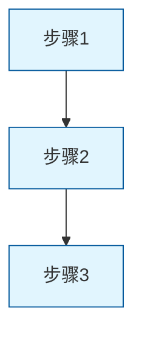

# [技术方案标题]

> [!abstract] 目录
> - [[#从使用到实现|从使用到实现]]
>   - [[#第一层 开发者怎么用|第一层：开发者怎么用]]
>   - [[#第二层 统一抽象是什么|第二层：统一抽象是什么]]
> - [[#核心架构设计|核心架构设计]]
>   - [[#整体架构图|整体架构图]]
>   - [[#核心概念定义|核心概念定义]]
> - [[#核心组件详解|核心组件详解]]
>   - [[#组件A|组件A]]
>   - [[#组件B|组件B]]
> - [[#底层原理|底层原理]]
>   - [[#原理A|原理A]]
>   - [[#原理B|原理B]]
> - [[#数据流分析|数据流分析]]
>   - [[#流程A|流程A]]
> - [[#扩展使用|扩展使用]]
> - [[#总结|总结]]

---

## 从使用到实现

> 先问一个问题：当你使用 [核心 API] 时，背后发生了什么？

### 第一层 开发者怎么用

> [!tip] 最简使用方式
> [最常用的 API 调用方式]

```[language]
// 最简单的使用示例
import { API } from '[package]';

// 调用示例
const result = API.method();
```

> [!question] 这里发生了什么？
> - [问题1]
> - [问题2]
> - [问题3]

### 第二层 统一抽象是什么

> [!tip] 核心价值
> [该方案的核心价值描述]

**换一个场景试试**：

```[language]
// 改变某个参数或场景
const result = API.method('[different-param]');
```

[解释这种抽象带来的价值]。

---

## 核心架构设计

### 整体架构图



### 核心概念定义

> 本节一句话说明：核心概念的简要描述。

#### 概念对比

| 概念 | 定义 | 示例 |
|------|------|------|
| **概念A** | [定义] | [示例] |
| **概念B** | [定义] | [示例] |

#### 数据结构

```typescript
interface [InterfaceName] {
  field1: type;
  field2: type;
}
```

> [!info] 选择原因
> - [原因1]
> - [原因2]

---

## 核心组件详解

### 组件A

> 本节一句话说明：组件A的作用。

#### 核心逻辑

```typescript
function ComponentA() {
  // 核心实现
}
```

#### 核心方法

| 方法 | 说明 |
|------|------|
| method1() | [说明] |
| method2() | [说明] |

### 组件B

> 本节一句话说明：组件B的作用。

#### 使用示例

```typescript
const result = ComponentB.method();
```

---

## 底层原理

### 原理A

> 本节一句话说明：原理A的核心思想。

#### 实现机制

```[language]
// 实现代码
```

#### 关键流程



### 原理B

> 本节一句话说明：原理B的核心思想。

#### 实现细节

```[language]
// 代码示例
```

#### 状态说明

| 状态 | 说明 |
|------|------|
| StateA | [说明] |
| StateB | [说明] |

---

## 数据流分析

### 流程A

从 [起点] 到 [终点] 的完整流程。



### 流程B

[另一个流程的描述]。



---

## 扩展使用

### 步骤 1 [扩展场景1]

[描述]。

```[language]
// 示例代码
```

### 步骤 2 [扩展场景2]

[描述]。

```[language]
// 示例代码
```

---

## 总结

> [!success] 核心要点
> 1. **[要点1]**：[一句话说明]
> 2. **[要点2]**：[一句话说明]
> 3. **[要点3]**：[一句话说明]
> 4. **[要点4]**：[一句话说明]

---

## 相关资料

- [官方文档](url)
- [[README|主题入口]]
- [[FAQ|常见问题]]
- [源码位置]
