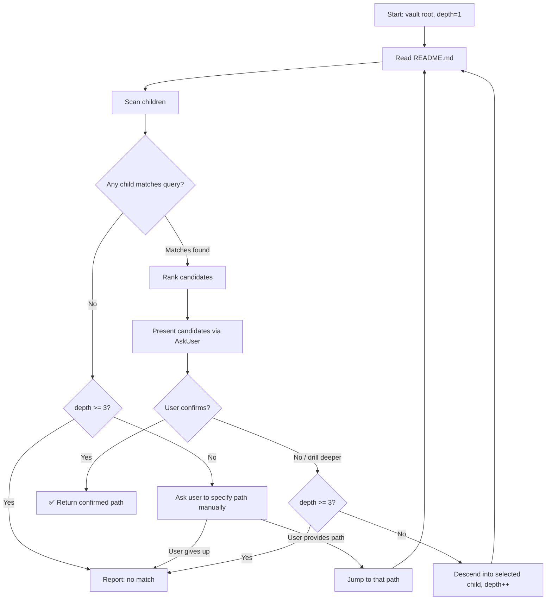

## Goal

Locate the most relevant topic directory in the knowledge tree based on the user's request.
Following the progressive disclosure principle, traversal starts from the vault root and descends layer by layer, with user confirmation at each proposed match.

## Input

- Vault root path (resolved from configuration `obsidian_vault_path`)
- User's topic search query (keywords or description)

## Constraints

- Maximum traversal depth: **5 layers** from vault root
- If no topic is confirmed within 5 layers, report that no matching topic was found

## Execution Steps

### Flow Overview



### 0a. Understand Topic Structure

Reference `references/framework-structure.md` to understand the topic directory structure.

### 0b. Validate Configuration

Reference `references/config-check-flow.md` to verify `obsidian_vault_path` is set and valid.

### 1. Resolve Vault Root

Use `obsidian_vault_path` from config as starting directory (depth = 1).

### 2. Read Current Layer

For the current directory:

1. Read its `README.md` (if it exists) to understand the scope of this node.
2. List all immediate subdirectories.
3. For each subdirectory, read its `README.md` (first 30–50 lines is sufficient) and extract:
   - Title / topic name
   - Definition sentence
   - Boundary / scope description

### 3. Rank Candidates

Match the user's query keywords against each subdirectory's README content using the following priority:

| Priority | Match Location |
|----------|---------------|
| High | Keyword in title or definition sentence |
| Medium | Keyword in boundary / includes / scope |
| Low | Keyword appears elsewhere in the file |
| No match | Keyword not found |

Keep only subdirectories with at least a **Low** match. If none qualify, proceed to step 5 (no match).

### 4. Confirm with User

Present the ranked candidates using the AskUser tool:

```
Found the following matching topics for "[query]":

1. /vault/programming/frontend/ — "Frontend development concepts including HTML, CSS, JavaScript frameworks"
2. /vault/programming/ — "Software programming knowledge base"

Which topic are you looking for? Select a number to confirm, or "more" to drill deeper into a candidate, or "none" to indicate no match.
```

- **User selects a number** → return that path as the confirmed topic. **Stop.**
- **User selects "more"** (or names a specific candidate to drill into) → descend into that subdirectory (depth + 1) and repeat from step 2.
- **User selects "none"** → proceed to step 5.

### 5. No Match at Current Layer

If no candidates were found **or** the user rejected all candidates:

- If `depth < 5`: inform the user that no match was found at this level, and ask if they want to manually specify a subdirectory path to continue searching. If they provide a path, jump there and continue. If not, stop.
- If `depth >= 5`: report that the topic was not found within 3 layers and stop.

```
⚠️ No matching topic found within 3 layers of the knowledge tree.

You may try:
- Rephrasing your query
- Manually browsing the vault with: tree -L 3 -d <vault_path>
- Creating a new topic with the "create topic" skill
```

### 6. Return Result

On success, output the confirmed topic path clearly:

```
✅ Topic located: /vault/programming/frontend/

README.md summary:
> Frontend development covers HTML, CSS, and JavaScript frameworks...
```

## Helper Tools

- List subdirectories: `ls -d /path/to/dir/*/`
- Quick directory tree: `tree -L 2 -d <path>`
